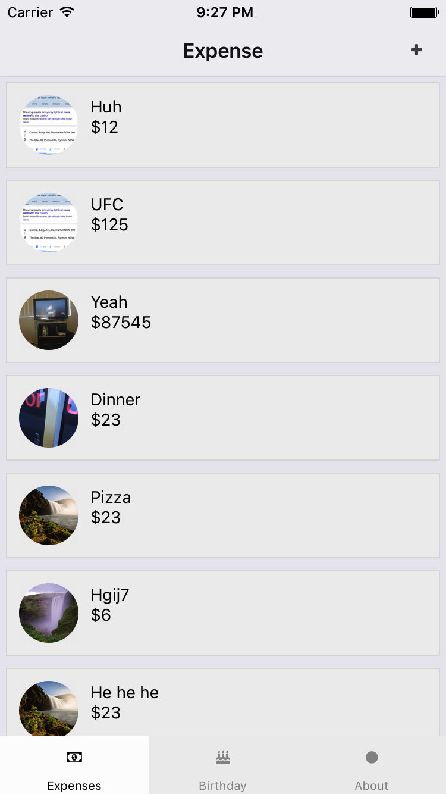

# FunCommunity

>This will help us track the user data and mark updates

`Technology Stack`

0. react-native
1. firebase
2. jest

`Prerequisites`

0. node and npm, preferred latest version
1. install yarn
2. install react-native
3. install android sdk, and have android emulator running/ have a developer device connected with machine

`Setup`

0. clone the repo
1. go into project directory in terminal
2. run command `yarn` (depending on preference)
3. run command `react-native run-android`

`Todo`

0. flow is a dependencies but is flow check is not done during build but will come in future

`Contribute:`

Fork the project and raise a PR.

### Screenshots

Expenses Screen:

---

Add Expense Screen:

---

Birthday Screen:

---

About Screen (because app have been built with :heart: )

